# 1.Introduction to MEISHA Chip
## 1.1 Overview
The MEISHA V100 is a silicon-proven SoC manufactured on a 40nm process. It integrates four 64-bit RISC-V RV64GC Rocket cores featuring a 5-stage in-order scalar pipeline with a clock speed of up to 1.0GHz. For AI workloads, the chip features an embedded NVIDIA DLA providing 0.5 TOPS of computing power. Equipped with comprehensive peripherals and interfaces, the platform fully supports the Linux operating system.

**Processing Units**
- Four 64-bit RISC-V RV64GC Rocket cores
- 5-stage in-order scalar pipeline
- RocketTile interconnection via S-BUS
- NVDLA (NVIDIA Deep Learning Accelerator) NPU

**Memory Hierarchy**
- DDR3 main memory (via FPGA)
- 1MB SRAM
- SD card external storage
- 64KB Boot ROM storage

**Bus Architecture**
- S-BUS: Core interconnection
- PERIPHERAL_BUS (AXI-based): Peripheral IP Interconnect: e.g. uart/sd/spi
- CONTROL_BUS: System control IP Interconnect: e.g. plic/clint/debug
- Chiplink: Chip-to-chip communication interface

**Key Peripheral Interfaces**
- UART: Serial communication
- SPI/QSPI: High-speed serial interface, Support Master/Slave Mode
- GPIO: General-purpose I/O
- JTAG: Debug interface

**System Control**
- PLL_WRAPPER: Clock management
- RST_GEN: Reset control
- CLINT: Core Local Interrupt Controller
- PLIC: Platform Level Interrupt Controller
- DTM: Debug and Trace Module

Each MEISHA V100 SoC contains four 64-bit RISC-V RV64GC Rocket cores an in-order scalar processor with 5-stage pipeline. In order to accelerate processor prototyping and provide a flexible framework for hardware/software interface validation, the FPGA prototype based on MEISHA V100 is publicly released.
<div align="center">

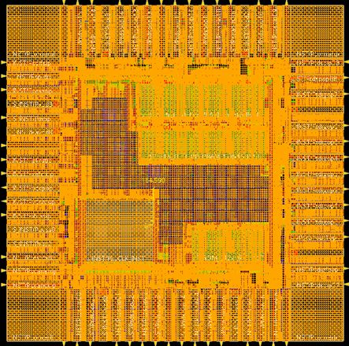
</div> 
<div align="center" style="font-size:14px;color:#000000;">Figure 1.FPGA Prototype Based on MEISHA V100</div> 

## 1.2 Project Contributors
RISC-V Group, Faculty of Computing Microelectronics, SUAT

Group Leader: Li HY, Mark
Module Design: Huang XC, Mark
FPGA Verification: Huang XC, Deng YF, Jiang J
Documentation: Jiang J, Deng YF
This guide aims to provide users with comprehensive instructions from hardware setup to software development, enabling rapid understanding and utilization of the MEISHA V100 platform for development purposes.

# 2.MEISHA Test Board Overview
The MEISHA hardware resource block diagram is as follows:
<div align="center">

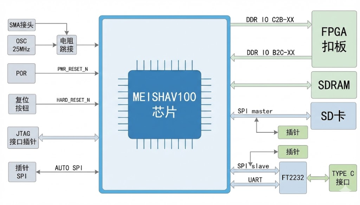
</div>
<div align="center" style="font-size:14px;color:#000000;">Figure 2.MEISHA Hardware Resource Block Diagram</div> <br>

PS (Processor System) is the hard processor system built into the chip, typically containing an ARM CPU and fixed peripherals, responsible for running software algorithms and system management; PL (Programmable Logic) is the programmable logic part of a traditional FPGA, which can be flexibly reconfigured according to requirements, mainly responsible for parallel computing, hardware acceleration, and custom interface implementation.

The MEISHA development board adopts a design combining an SoC baseboard and an FPGA core board. The FPGA core board uses the ZYNQ7020 chip. The onboard resources of the SoC baseboard are shown in the following figure:
<div align="center">

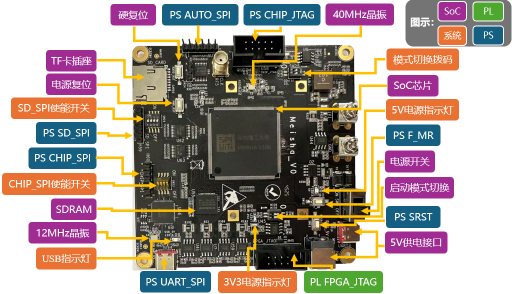
</div> 
<div align="center" style="font-size:14px;color:#000000;">Figure 3.SoC Baseboard Onboard Resources</div> <br>

The FPGA core board used with the SoC baseboard is shown in the following figure:
<div align="center"> 

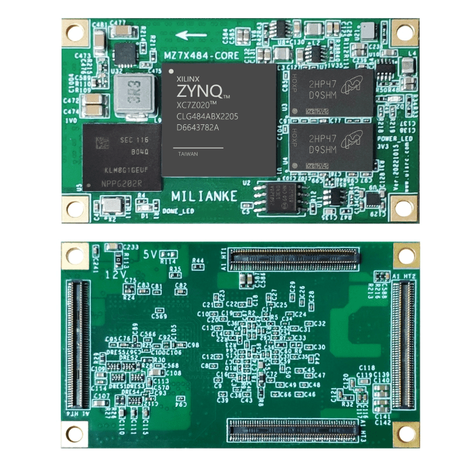
</div> 
<div align="center" style="font-size:14px;color:#000000;">Figure 4.FPGA Core Board</div><br>

The onboard resources of the FPGA core board are as follows:
- Main Chip: XC7Z020CLG484-1I
- ARM Specification: Cortex-A9 dual-core, main frequency 667M
- FPGA Specification:
  - Architecture: Artix-7
  - Logic Cells: 85K
  - Look-Up Tables (LUTs): 53,200
  - Block RAM: 4.9Mb
  - DSP slices: 220
  - Flip-flops: 106,400
  - Speed Grade: -1, corresponding to a main frequency of 667 MHz
- DDR3L: MT41K256M16TW-107:P * 2 (512x2 MB), 2 chips connected to the PS memory interface, supporting up to 1066MHz main frequency
- eMMC: KLM8G1GEME-B041 (8GB), connected to the PS peripheral interface, using SD mode, supporting up to 50MHz clock frequency
- Flash: W25Q128FV (16MB), connected to the PS peripheral interface, quad-mode, supporting up to 104MHz clock frequency
- Crystal Oscillator: 1 channel 33.3333MHz active crystal oscillator, connected to the PS interface
- 4 DF40HC-100DP board-to-board connectors
  - 54 PS MIO pins are brought out
  - 200 PL pins (96 differential pairs) are brought out

The detailed introduction of peripherals and interfaces is shown in the following table:
**SoC**
- Onboard 40MHz crystal oscillator
- External 5V power input, selectable via USB/DC
- Power DIP switch SW9
- Power reset button SW3
- Hard reset button SW24
- LED indicators
- DIP switch SW21 to change the FPGA boot location

**PS**
- DIP switch SW25, used to modify DEBUG_MODE_SEL and DEBUG_MODE_CONFIG
- CHIP_JTAG debug interface U58
- AUTO_SPI debug interface H61
- CHIP_SPI debug interface H60
- DIP switch SW23, controls H60 signal selection
- Pins connected to FT2232 H62
- SD_SPI debug interface H59
- DIP switch SW26, controls H59 signal selection
- UART2 interface connected to FT2232
- 512MB SDRAM

**PL**
- FPGA_JTAG debug interface U16
- FPGA expansion connectors CN1, CN2, CN5, CN6

<div align="center" style="font-size:14px;color:#000000;">Table 1.memory map:</div>

| Base               | Size（B）                                                                               | Description                                          | Notes                                                                                |
| ------------------ | ------------------------------------------------------------------------------------- | ---------------------------------------------------- | ------------------------------------------------------------------------------------ |
| 0x0000_0000        | 4K                                                                                    | debug-controller                                     |                                                                                      |
| 0x0000_3000        | 4K                                                                                    | error-device                                         |                                                                                      |
| 0x0001_0000        | 8K                                                                                    | Mask ROM (32 KiB)                                    |                                                                                      |
| 0x0200_0000        | 64K                                                                                   | CLINT                                                |                                                                                      |
| 0x0C00_0000        | 4M                                                                                    | PLIC                                                 |                                                                                      |
| 0x5000_0000        | 0x6000_0000(256M)                                                                     | PCIE HOST 空间                                         |                                                                                      |
| 0x5000_0000        | 1M                                                                                    | on chip sram                                         |                                                                                      |
| 0x5100_0000        | 4K                                                                                    | soc_lsys                                             |                                                                                      |
| 0x5200_0000        | 4K                                                                                    | spi_1                                                |                                                                                      |
| 0x6000_0000        | 0x6400_0000                                                                           | TIMEOUT                                              |                                                                                      |
| 0x20_0000_0000     | 0x20_0800_0000/128M                                                                   | pci ctrl 空间 timeout                                  |                                                                                      |
| 0x20_0800_0000     | 0x20_1000_0000                                                                        | TIME_OUT                                             |                                                                                      |
| 0x20_1000_0000     | 0x21_000_0000                                                                         | TIME_OUT                                             |                                                                                      |
| 0x21_0000_0000     | 0x3F_FFFF_FFFF                                                                        | TIME_OUT                                             |                                                                                      |
| 0x6400_0000        | 4K                                                                                    | serial                                               | Does not support narrow, sparse                                                                   |
| 0x6400_1000        | 4K                                                                                    | spi_0                                                | Does not support narrow, sparse                                                                    |
| 0x6400_2000        | 4K                                                                                    | gpio                                                 | Does not support narrow, sparse                                                                    |
| 0x8000_0000        | 512M                                                                                  | CHIPLINK                                             |                                                                                      |
| 0xA000_0000        | 512M                                                                                  | DDR（SDRAM）                                           |                                                                                      |
| 0xC000_0000        | 1G                                                                                    | TIME_OUT                                             | Note: Access to this memory space is not allowed; attempting to do so may cause abnormal behavior.                                                             |
| MIG_CHIPLINK_SLAVE | 1 MIG real space 0x8000_0000 - 0xC000_0000 can be remapped to the following space: 0x1000_0000 - 0xE000_0000 (13*256=3328M) | 1 slave port requires address remap, the highest 4 bits can be controlled, connected to SOC_LSYS, default highest 4 bits changed to 1| Integrate chiplink into meishav100 version for subsequent verification 1. Currently, the chiplink peer address is 1000_0000-3000_0000, needs adaptation to the peer chiplink controller |

<div align="center" style="font-size:14px;color:#000000;">Table 2.Register Default Values Table:</div>

<table style="width:100%; border-collapse:collapse; font-size:12px; line-height:1.3;">
<thead>
<tr style="background-color:#f0f0f0;">
<th style="width:6%; border:1px solid #ddd; padding:3px; text-align:left; word-wrap:break-word; overflow-wrap:break-word;">Module</th>
<th style="width:6%; border:1px solid #ddd; padding:3px; text-align:left; font-size:11px; word-wrap:break-word; overflow-wrap:break-word;">Base Addr</th>
<th style="width:11%; border:1px solid #ddd; padding:3px; text-align:left; word-wrap:break-word; overflow-wrap:break-word;">Register</th>
<th style="width:6%; border:1px solid #ddd; padding:3px; text-align:center;">Offset</th>
<th style="width:6%; border:1px solid #ddd; padding:3px; text-align:center;">Dflt1</th>
<th style="width:6%; border:1px solid #ddd; padding:3px; text-align:center;">Dflt2</th>
<th style="width:39%; border:1px solid #ddd; padding:3px; text-align:left; word-wrap:break-word; overflow-wrap:break-word;">Description</th>
</tr>
</thead>
<tbody>
<tr>
<td style="width:6%; border:1px solid #ddd; padding:3px; word-wrap:break-word;">serial</td>
<td style="width:6%; border:1px solid #ddd; padding:3px; font-size:10px;">0x640000</td>
<td style="width:11%; border:1px solid #ddd; padding:3px; word-wrap:break-word;">txdata</td>
<td style="width:6%; border:1px solid #ddd; padding:3px; text-align:center;">0x00</td>
<td style="width:6%; border:1px solid #ddd; padding:3px; text-align:center;">0x0</td>
<td style="width:6%; border:1px solid #ddd; padding:3px;"></td>
<td style="width:39%; border:1px solid #ddd; padding:3px;"></td>
</tr>
<tr>
<td style="width:6%; border:1px solid #ddd; padding:3px;"></td>
<td style="width:6%; border:1px solid #ddd; padding:3px;"></td>
<td style="width:11%; border:1px solid #ddd; padding:3px; word-wrap:break-word;">rxdata</td>
<td style="width:6%; border:1px solid #ddd; padding:3px; text-align:center;">0x04</td>
<td style="width:6%; border:1px solid #ddd; padding:3px; text-align:center;">0x80000000</td>
<td style="width:6%; border:1px solid #ddd; padding:3px;"></td>
<td style="width:39%; border:1px solid #ddd; padding:3px;"></td>
</tr>
<tr>
<td style="width:6%; border:1px solid #ddd; padding:3px;"></td>
<td style="width:6%; border:1px solid #ddd; padding:3px;"></td>
<td style="width:11%; border:1px solid #ddd; padding:3px; word-wrap:break-word;">txctrl</td>
<td style="width:6%; border:1px solid #ddd; padding:3px; text-align:center;">0x08</td>
<td style="width:6%; border:1px solid #ddd; padding:3px; text-align:center;">0x0</td>
<td style="width:6%; border:1px solid #ddd; padding:3px;"></td>
<td style="width:39%; border:1px solid #ddd; padding:3px;"></td>
</tr>
<tr>
<td style="width:6%; border:1px solid #ddd; padding:3px;"></td>
<td style="width:6%; border:1px solid #ddd; padding:3px;"></td>
<td style="width:11%; border:1px solid #ddd; padding:3px; word-wrap:break-word;">rxctrl</td>
<td style="width:6%; border:1px solid #ddd; padding:3px; text-align:center;">0x0C</td>
<td style="width:6%; border:1px solid #ddd; padding:3px; text-align:center;">0x0</td>
<td style="width:6%; border:1px solid #ddd; padding:3px;"></td>
<td style="width:39%; border:1px solid #ddd; padding:3px;"></td>
</tr>
<tr>
<td style="width:6%; border:1px solid #ddd; padding:3px;"></td>
<td style="width:6%; border:1px solid #ddd; padding:3px;"></td>
<td style="width:11%; border:1px solid #ddd; padding:3px; word-wrap:break-word;">div</td>
<td style="width:6%; border:1px solid #ddd; padding:3px; text-align:center;">0x18</td>
<td style="width:6%; border:1px solid #ddd; padding:3px; text-align:center;">0x1b2</td>
<td style="width:6%; border:1px solid #ddd; padding:3px;"></td>
<td style="width:39%; border:1px solid #ddd; padding:3px;"></td>
</tr>
<tr>
<td style="width:6%; border:1px solid #ddd; padding:3px;">pll</td>
<td style="width:6%; border:1px solid #ddd; padding:3px; font-size:10px;">0x510000</td>
<td style="width:11%; border:1px solid #ddd; padding:3px; word-wrap:break-word;">DEBUG_<br>MODE_<br>CONFIG</td>
<td style="width:6%; border:1px solid #ddd; padding:3px; text-align:center;">/</td>
<td style="width:6%; border:1px solid #ddd; padding:3px; text-align:center;">0</td>
<td style="width:6%; border:1px solid #ddd; padding:3px; text-align:center;">1</td>
<td style="width:39%; border:1px solid #ddd; padding:3px;">DIP SW25 affects register defaults</td>
</tr>
<tr>
<td style="width:6%; border:1px solid #ddd; padding:3px;"></td>
<td style="width:6%; border:1px solid #ddd; padding:3px;"></td>
<td style="width:11%; border:1px solid #ddd; padding:3px; word-wrap:break-word;">unlock_<br>reg</td>
<td style="width:6%; border:1px solid #ddd; padding:3px; text-align:center;">0x00</td>
<td style="width:6%; border:1px solid #ddd; padding:3px; text-align:center;">0x1</td>
<td style="width:6%; border:1px solid #ddd; padding:3px; text-align:center;">0x1</td>
<td style="width:39%; border:1px solid #ddd; padding:3px;"></td>
</tr>
<tr>
<td style="width:6%; border:1px solid #ddd; padding:3px;"></td>
<td style="width:6%; border:1px solid #ddd; padding:3px;"></td>
<td style="width:11%; border:1px solid #ddd; padding:3px; word-wrap:break-word;">pll_cfg<br>_reg<br>[31:0]</td>
<td style="width:6%; border:1px solid #ddd; padding:3px; text-align:center;">0x08</td>
<td style="width:6%; border:1px solid #ddd; padding:3px; text-align:center;">0x1</td>
<td style="width:6%; border:1px solid #ddd; padding:3px; text-align:center;">0x1</td>
<td style="width:39%; border:1px solid #ddd; padding:3px; font-size:11px;"><code>[4:0]</code>pre-div M(1-31), <code>[28:5]</code>frac(n/a)</td>
</tr>
<tr>
<td style="width:6%; border:1px solid #ddd; padding:3px;"></td>
<td style="width:6%; border:1px solid #ddd; padding:3px;"></td>
<td style="width:11%; border:1px solid #ddd; padding:3px; word-wrap:break-word;">pll_cfg<br>_reg<br>[63:32]</td>
<td style="width:6%; border:1px solid #ddd; padding:3px; text-align:center;">0x10</td>
<td style="width:6%; border:1px solid #ddd; padding:3px; text-align:center;">0xc98663</td>
<td style="width:6%; border:1px solid #ddd; padding:3px; text-align:center;">0xc98663</td>
<td style="width:39%; border:1px solid #ddd; padding:3px; font-size:11px;">Fvco=Fref×NI÷M. Q0_0/Q1_0/Q0_1/Q1_1/Q0_2/Q1_2 (1-8 each)</td>
</tr>
<tr>
<td style="width:6%; border:1px solid #ddd; padding:3px;"></td>
<td style="width:6%; border:1px solid #ddd; padding:3px;"></td>
<td style="width:11%; border:1px solid #ddd; padding:3px; word-wrap:break-word;">pll_cfg<br>_mix[31]</td>
<td style="width:6%; border:1px solid #ddd; padding:3px; text-align:center;">0x100</td>
<td style="width:6%; border:1px solid #ddd; padding:3px; text-align:center;">0x1</td>
<td style="width:6%; border:1px solid #ddd; padding:3px; text-align:center;">0x1</td>
<td style="width:39%; border:1px solid #ddd; padding:3px; font-size:11px;">Power-down. Set 0→enable. Modify: switch ref_clk, pd=1, wait ≥1µs, pd=0</td>
</tr>
<tr>
<td style="width:6%; border:1px solid #ddd; padding:3px;"></td>
<td style="width:6%; border:1px solid #ddd; padding:3px;"></td>
<td style="width:11%; border:1px solid #ddd; padding:3px; word-wrap:break-word;">use_<br>which_<br>clk_reg</td>
<td style="width:6%; border:1px solid #ddd; padding:3px; text-align:center;">0x18</td>
<td style="width:6%; border:1px solid #ddd; padding:3px; text-align:center;">0x95000</td>
<td style="width:6%; border:1px solid #ddd; padding:3px; text-align:center;">0x0</td>
<td style="width:39%; border:1px solid #ddd; padding:3px; font-size:11px;">0=ref,2-16=ref÷2/4/.../30, 17-31=pll÷2/.../30. NZ for CPU</td>
</tr>
<tr>
<td style="width:6%; border:1px solid #ddd; padding:3px;"></td>
<td style="width:6%; border:1px solid #ddd; padding:3px;"></td>
<td style="width:11%; border:1px solid #ddd; padding:3px; word-wrap:break-word;">pll_<br>state_<br>reg</td>
<td style="width:6%; border:1px solid #ddd; padding:3px; text-align:center;">0x20</td>
<td style="width:6%; border:1px solid #ddd; padding:3px; text-align:center;">0x40000001</td>
<td style="width:6%; border:1px solid #ddd; padding:3px; text-align:center;">0x80000000</td>
<td style="width:39%; border:1px solid #ddd; padding:3px;"></td>
</tr>
<tr>
<td style="width:6%; border:1px solid #ddd; padding:3px;">chiplink</td>
<td style="width:6%; border:1px solid #ddd; padding:3px;"></td>
<td style="width:11%; border:1px solid #ddd; padding:3px; word-wrap:break-word;">chiplink<br>tx</td>
<td style="width:6%; border:1px solid #ddd; padding:3px; text-align:center;">0xB0</td>
<td style="width:6%; border:1px solid #ddd; padding:3px; text-align:center;">0x318c6305</td>
<td style="width:6%; border:1px solid #ddd; padding:3px;"></td>
<td style="width:39%; border:1px solid #ddd; padding:3px;"></td>
</tr>
<tr>
<td style="width:6%; border:1px solid #ddd; padding:3px;"></td>
<td style="width:6%; border:1px solid #ddd; padding:3px;"></td>
<td style="width:11%; border:1px solid #ddd; padding:3px; word-wrap:break-word;">chiplink<br>rx</td>
<td style="width:6%; border:1px solid #ddd; padding:3px; text-align:center;">0xB8</td>
<td style="width:6%; border:1px solid #ddd; padding:3px; text-align:center;">0x318c6305</td>
<td style="width:6%; border:1px solid #ddd; padding:3px;"></td>
<td style="width:39%; border:1px solid #ddd; padding:3px;"></td>
</tr>
<tr>
<td style="width:6%; border:1px solid #ddd; padding:3px;"></td>
<td style="width:6%; border:1px solid #ddd; padding:3px;"></td>
<td style="width:11%; border:1px solid #ddd; padding:3px; word-wrap:break-word;">mig_slave<br>_base_<br>addr_<br>msb_4</td>
<td style="width:6%; border:1px solid #ddd; padding:3px; text-align:center;">0x40</td>
<td style="width:6%; border:1px solid #ddd; padding:3px; text-align:center;">0x8</td>
<td style="width:6%; border:1px solid #ddd; padding:3px;"></td>
<td style="width:39%; border:1px solid #ddd; padding:3px;"></td>
</tr>
</tbody>

</table>

## 2.1 Power-On Testing
This chapter mainly introduces how to perform basic hardware and software tests on the board. The specific steps for power-on testing are shown in the following figure:
<div align="center"> 

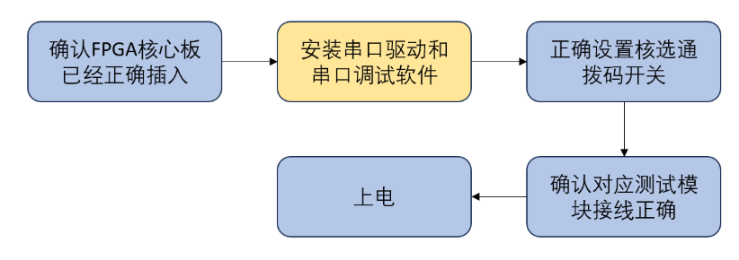
</div> 
<div align="center" style="font-size:14px;color:#000000;">Figure 5.Power-On Test Procedure Flowchart</div><br>

The blue parts are purely hardware operations, while the yellow parts involve software operations.

⚠️ Debugging Precautions
- Avoid plugging or unplugging while the power is on to prevent latch-up effects caused by improper hot-swapping, which could damage the chip.
- After power-on, if any abnormal phenomena such as smoke, unusual odors, electrical discharge sounds or lights, or components overheating occur, immediately disconnect the power supply.

### 2.1.1 Hardware Operations
First, when installing or removing the FPGA, align the connectors of the MEISHA board and the FPGA, and press down firmly vertically or pull it out. After the FPGA is correctly inserted, connect the necessary debugger according to the schematic diagram, power on, and the normal working effect is shown in the figure:
<div align="center"> 

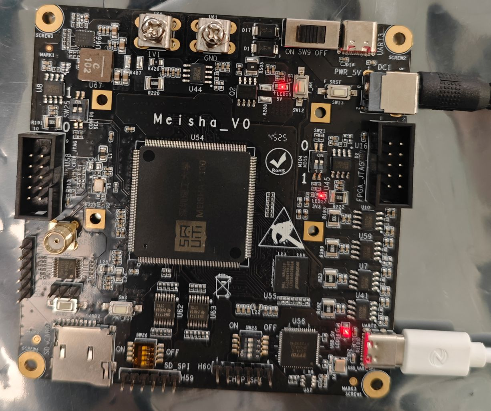
</div> 
<div align="center" style="font-size:14px;color:#000000;">Figure 6.Board Normal Working Condition</div>

### 2.1.2 SPI_SLAVE
SPI_SLAVE is a debug module that directly accesses all accessible address spaces inside the chip through the bus. It is used to verify on-chip peripherals and conduct preliminary testing of the MEISHA chip.
<div align="center"> 

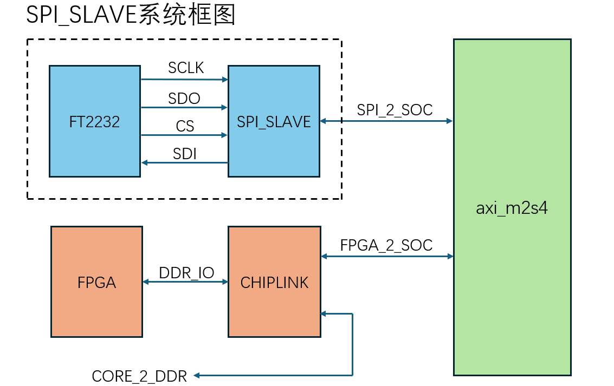
</div> 
<div align="center" style="font-size:14px;color:#000000;">Figure 7.SPI_SLAVE System Block Diagram</div>

#### SPI_SLAVE Board-Level Design
The pins of SPI_SLAVE are SPI SCLK, SPI CS, SPI DATA[3:0].
<div align="center"> 

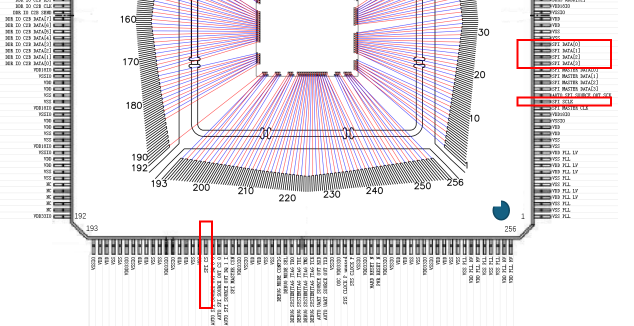
</div> 
<div align="center" style="font-size:14px;color:#000000;">Figure 8.SPI_SLAVE Pinout</div><br>

The SPI_SLAVE_TEST_MODE signal should default to 1; it seems it is not available as an input pin. When it is 1, SPI SCLK is used as the module clock. It needs to be configured to 0. Configuring it to 1 is for DFT SCAN mode, which is not actually used.

By default, SPI dual-wire full-duplex mode is used, so only SPI SCLK, SPI CS, SPI DATA0, and SPI DATA1 are used. SPI DATA0 corresponds to SPI DO (MOSI), and SPI DATA1 corresponds to SPI DI (MISO). The SPI_SLAVE pins of the MEISHA chip are directly connected to a voltage level translator chip (SN74AXC4T774PWR), which converts the core's 1.8V to the FT2232's 3.3V.
<div align="center"> 

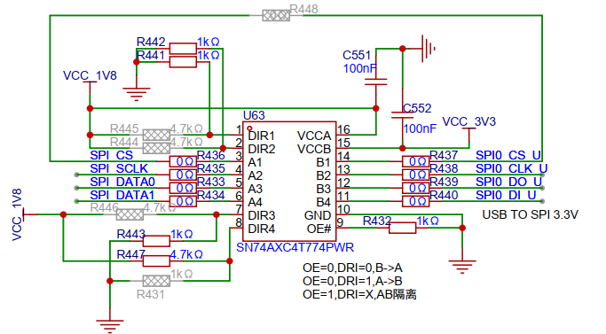
</div> 
<div align="center" style="font-size:14px;color:#000000;">Figure 9.SPI_SLAVE Level Shifting Circuit</div><br>

The corresponding channel signals are level-shifted through the voltage level translator chip (A1 corresponds to B1). SPI_DATA0 (core 1.8V) is converted to SPI_DO_U (3.3V connected to FT2232).

Then, DIP switch SW23 is used to select whether to connect to the onboard FT2232 chip or to connect to an external FT2232 via the H60 pins. When connected to the onboard FT2232, H60 can be connected to a logic analyzer to capture SPI signals for debugging, etc.
<div align="center"> 

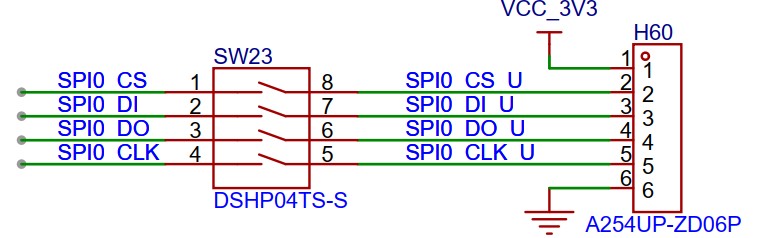
</div> 
<div align="center" style="font-size:14px;color:#000000;">Figure 10.SPI_SLAVE DIP Switch Connection</div><br>

The SPI_DO_U signal is connected via DIP switch SW23 to SPI DO, which is connected to the BDBUS channel of the FT2232HQ. Therefore, the BDBUS channel of the FT2232HQ needs to be configured as an SPI interface. For details, see "FT2232 Development Board User Manual.pdf".

The onboard FT2232HQ is equipped with a 93AA56BT-I/OT EEPROM as non-volatile memory. To program the FT2232HQ, the board must be powered on to supply power to the FT2232HQ, as the USB interface alone does not power it.
<div align="center"> 

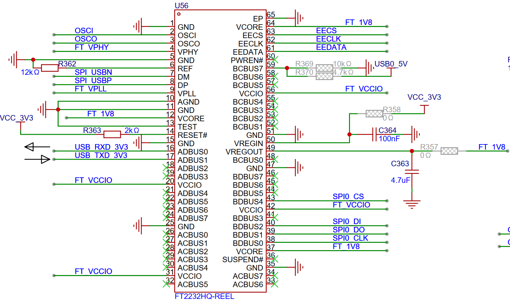
</div> 
<div align="center" style="font-size:14px;color:#000000;">Figure 11.FT2232HQ Chip</div><br>

For more flexible use of the SPI chip select signal, the FT2232 BDBUS hardware SPI CS (BDBUS3) is not used; instead, a GPIO (BDBUS4) is used as the chip select signal. When programming the FT2232 SPI, the chip select signal is manually operated via GPIO to meet command requirements.

### 2.1.3 Clock and PLL
The onboard crystal oscillator clock is 40MHz, single-ended input to MEISHA, connected to SYS CLOCK P.
<div align="center">

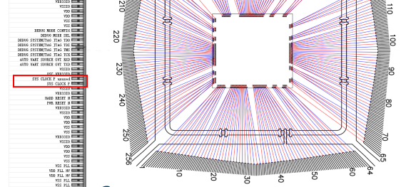
</div> 
<div align="center" style="font-size:14px;color:#000000;">Figure 12.SYS_CLOCK_P Input Connection</div><br>

The entire SoC system is divided into four clock domains: 🔴 CPU (RocketTile), 🟡 main, 🟢 chiplink, 🔵 ddr.
<div align="center"> 

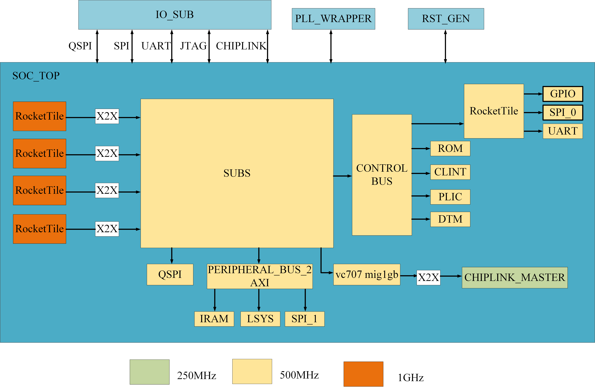
</div> 
<div align="center" style="font-size:14px;color:#000000;">Figure 13.SoC Clock Domain Partition</div><br>

Refer to this diagram for details; additionally, the DDR clock domain is not marked, used for the SDR SDRAM chip and the SDRAM controller. The CPU domain mainly consists of the 4 CPU cores. The main clock domain contains most of the sub-modules, system bus, various peripherals, IRAM, etc. The chiplink clock domain is the chiplink bus for communication with the FPGA subsystem. The DDR clock domain is the clock domain for the SDRAM controller and the SDR SDRAM chip.

The crystal oscillator inputs 40MHz as ref_clk into the PLL. The PLL has three registers that can be configured. Finally, three clock domain outputs are generated through frequency division: cpu, main, chiplink. The DDR clock is directly connected to the chiplink clock.
<div align="center"> 

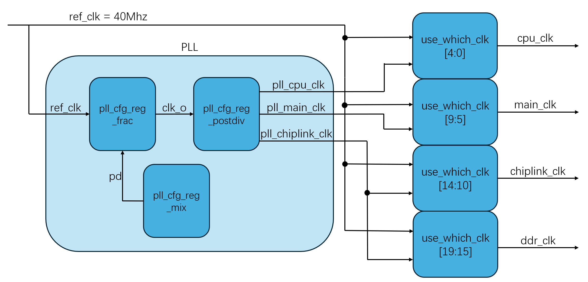
</div> 
<div align="center" style="font-size:14px;color:#000000;">Figure 14.PLL Structure Diagram</div>


### 2.1.4 JTAG Debugging
<div align="center"> 

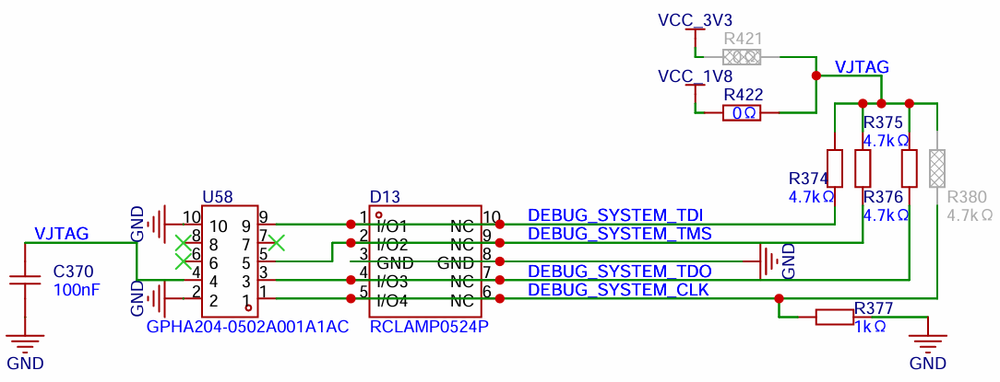
</div> 
<div align="center" style="font-size:14px;color:#000000;">Figure 15.JTAG Connection Diagram</div><br>

Connect the chip to the JTAG debugger as shown in the wiring diagram. Pin 9 of output U58 corresponds to the DEBUG_SYSTEM_TDI signal, pin 5 corresponds to the DEBUG_SYSTEM_TMS signal, pin 3 corresponds to the DEBUG_SYSTEM_TDO signal, pin 1 corresponds to the DEBUG_SYSTEM_CLK signal, and pin 10 is connected to ground.

Connect the JTAG debugger to the computer. In the JTAG folder, open Windows cmd and enter `openocd -f freedom.cfg` to start the openocd debugger, as shown in the figure:
<div align="center"> 

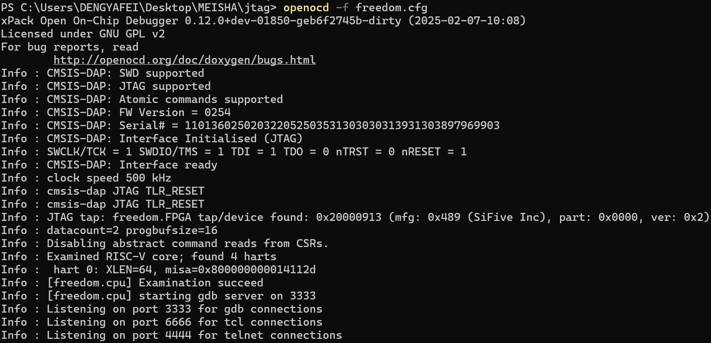
</div> 
<div align="center" style="font-size:14px;color:#000000;">Figure 16.OpenOCD Startup Interface</div><br>

Open MobaXterm and open a Telnet connection to localhost:4444 to connect to the board, as shown in the figure:
<div align="center"> 

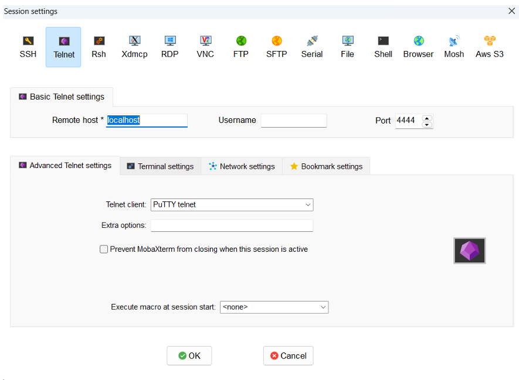
</div> 
<div align="center" style="font-size:14px;color:#000000;">Figure 17.GDB Connection Interface</div><br>

Before executing instructions, the `halt` command is needed to pause the core for test reads and writes.
<div align="center"> 

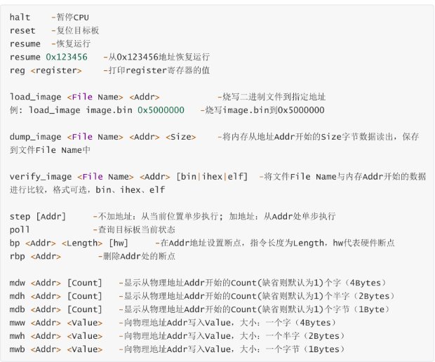
</div> 
<div align="center" style="font-size:14px;color:#000000;">Figure 18.OpenOCD Common Commands</div>

### 2.1.5 SRAM Program Execution Test
To boot from SRAM, the following conditions must be met:
- The program must be linked with the SRAM physical address as the link address.
- The program must be burned to the corresponding SRAM physical address.
- The boot code must jump to that SRAM address for execution.

In the `sdboot.elf.lds` file, modify the target memory region for the .text section from `maskrom_mem` to `memory_mem`, so that the program generates instructions based on the SRAM address during linking.
<div align="center"> 

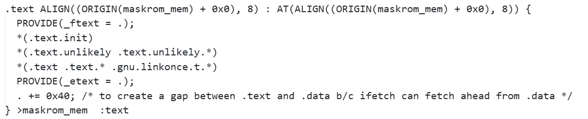
</div> 
<div align="center" style="font-size:14px;color:#000000;">Figure 19.Linker Script Modification Example</div><br>

The boot code specifies the execution start address of the user program via `PAYLOAD_DEST`. Set `PAYLOAD_DEST` in `head.s` to the SRAM start physical address, so that the processor fetches and executes the user program from SRAM.
<div align="center"> 

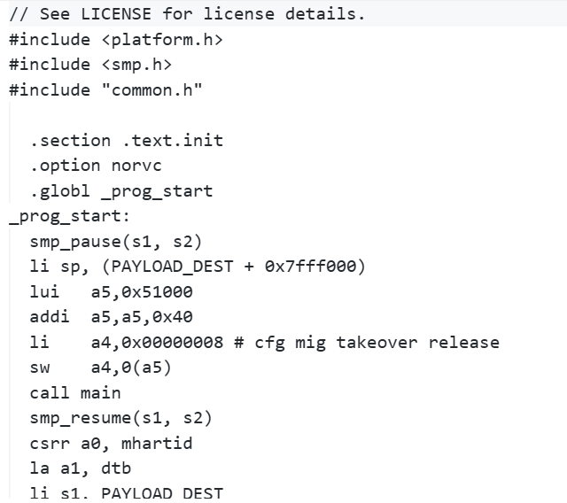
</div> 
<div align="center" style="font-size:14px;color:#000000;">Figure 20.Boot Address Setting</div><br>

During testing, first ensure DEBUG_MODE_SEL is set to 1, corresponding to the core not being released from reset. After reset release, it defaults to booting from ON CHIP SRAM. Write 1 to the reset register sft_rst_reg to keep the core in reset and not running. Modify the head.s and sdboot.elf.lds files, compile and generate a hex file, and burn the hex file to the corresponding SRAM address. Then change the reset register value to 0, and observe the output in the serial port assistant to see if it meets expectations.
<div align="center">

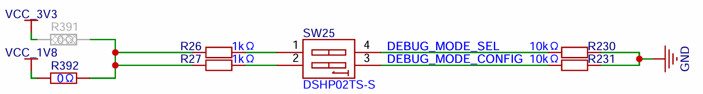
</div> 
<div align="center" style="font-size:14px;color:#000000;">Figure 21.DIP Switch SW25 Setting (Boot Mode)</div>

### 2.1.6 UART Debugging
Check if the `DEBUG_MODE_CONFIG` on DIP switch SW25 corresponds to 1 (which means using the 40MHz clock). According to the formula:
$f_{baud}=\frac{f_{in}}{div+1}$
where f_baud is 115200, calculate the current UART div and modify the register to ensure the UART can sample correctly.
<div align="center"> 


</div> 
<div align="center" style="font-size:14px;color:#000000;">Figure 22.DIP Switch SW25 Setting (UART Debug)</div>
<div align="center"> 

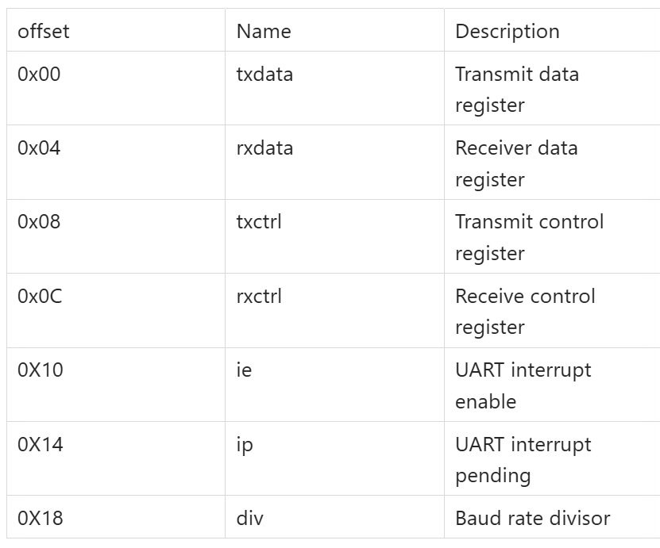
</div> 
<div align="center" style="font-size:14px;color:#000000;">Figure 23.UART Registers</div>

### 2.1.7 SD Card Data Read Debugging
#### 1. Writing Data to SD Card
Use WinHex to write data to the SD card:

Start the software as an administrator, open the physical drive corresponding to the SD card on the computer, write the clipboard data, and select ASCII HEX format.

#### 2. SD Card Data Read Verification
Refer to the logic in `sd.c` and rewrite the SD card control program `SD.py` in Python.

Hardware Configuration:
- DEBUG_MODE_SEL is set to 1, core does not boot.
- DEBUG_MODE_CONFIG is set to 3, uses 40MHz reference clock.
<div align="center"> 


</div> 
<div align="center" style="font-size:14px;color:#000000;">Figure 24.USD Card Debug Hardware Configuration</div><br>

The software driver actually operates the pins of the auto_spi module.

Check the hardware power supply of the external SD module and adjust its power to a stable 3.3V.
<div align="center"> 

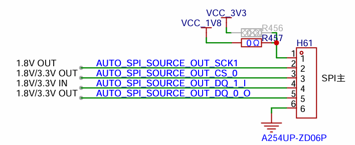
</div> 
<div align="center" style="font-size:14px;color:#000000;">Figure 25.SD Card Module Power Supply Check</div><br>

Considering that SD initialization is sensitive to timing, adjust the clock division parameters of the SPI module so that the SCK clock does not exceed 20MHz, ensuring the SCK frequency during the initialization phase is within the acceptable range for the SD card.

The code workflow first initializes the SD card, then reads data.

The controller sequentially sends commands to the SD card: cmd0, cmd8, acmd41, cmd58, CMD18.

Specify the sector address to read. The SD card returns a response and sends the data block to the controller.

Write data `AABBCCDDEEFF` to address 0 of sector 0 in advance. The code runs the commands normally and reads the 512 bytes of data from that sector.

The overall initialization process runs smoothly, and the SD card read/write test is finally successful.
<div align="center"> 

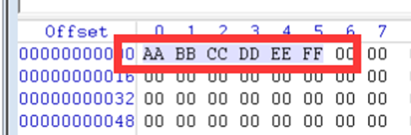
<div align="center" style="font-size:14px;color:#000000;">Figure 26.SD Card Read/Write Test Success Screenshot 1</div><br>

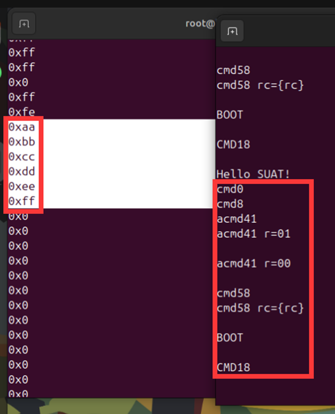
</div> 
<div align="center" style="font-size:14px;color:#000000;">Figure 27.SD Card Read/Write Test Success Screenshot 2</div>

### 2.1.8 Installing Serial Port Driver
The board currently uses the FT2232, a USB to serial and parallel interface converter. PyFTDI is a pure Python library for controlling FTDI devices, allowing easy control of FT232H, FT4232H, FT2232H, and other USB-to-serial chips via Python, enabling UART, SPI, I2C, GPIO, and other interface communications. Installation method is as follows:
[https://eblot.github.io/pyftdi/installation.html](https://eblot.github.io/pyftdi/installation.html)

### 2.1.9 Installing Serial Debugging Software
Serial debugging software is needed to monitor the board's output. There are many commonly used serial debugging tools on the market, such as Minicom, MobaXterm, Xshell, etc. Since this document is used on a Linux system, minicom is chosen. Installation and usage tutorials can be found at:
[https://blog.csdn.net/gitblog_09787/article/details/142976810](https://blog.csdn.net/gitblog_09787/article/details/142976810)

### 2.1.10 Chiplink
There is not much detailed introduction about Chiplink, and its usage mainly refers to the FPGA development section of the "One Life One Chip" board.
https://ysyx.oscc.cc/chip/board/official/boards/board-3/#%E7%A1%AC%E4%BB%B6%E8%AE%BE%E8%AE%A1
<div align="center"> 

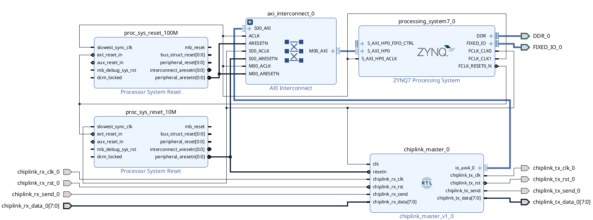
</div> 
<div align="center" style="font-size:14px;color:#000000;">Figure 28.Chiplink System Block Design Overview</div><br>
When building the system according to the block diagram above, the following four points need attention:

- The UART1 interface must be enabled in the ZYNQ7 Processing System; otherwise, the Vitis project for "Hello World" cannot be created.

- The ZYNQ7 Processing System should output two clocks: a 10MHz clock for the Chiplink module (must not exceed 25MHz) and a 100MHz clock for the ZYNQ7 Processing System itself.
<div align="center">


</div> 
<div align="center" style="font-size:14px;color:#000000;">Figure 29.ZYNQ7 Processing System Clock Configuration</div><br>

- The DDR memory model must be modified to the correct one.
<div align="center">

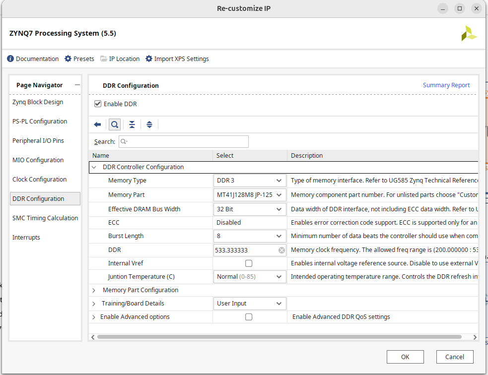
</div> 
<div align="center" style="font-size:14px;color:#000000;">Figure 30.DDR Memory Part Number Configuration</div><br>

- Pin constraints need to be added:
```none
create_generated_clock -name chiplink_rx_clk -source [get_pins top_i/chiplink_master_0/clk] -divide_by 1 [get_ports chiplink_rx_clk_0]
set_input_delay -clock [get_clocks chiplink_rx_clk] -min -add_delay 0.680 [get_ports {chiplink_rx_data_0[*]}]
set_input_delay -clock [get_clocks chiplink_rx_clk] -max -add_delay 2.500 [get_ports {chiplink_rx_data_0[*]}]
set_input_delay -clock [get_clocks chiplink_rx_clk] -min -add_delay 0.680 [get_ports chiplink_rx_rst_0]
set_input_delay -clock [get_clocks chiplink_rx_clk] -max -add_delay 2.500 [get_ports chiplink_rx_rst_0]
set_input_delay -clock [get_clocks chiplink_rx_clk] -min -add_delay 0.680 [get_ports chiplink_rx_send_0]
set_input_delay -clock [get_clocks chiplink_rx_clk] -max -add_delay 2.500 [get_ports chiplink_rx_send_0]

create_clock -period 40.000 -name chiplink_tx_clk -waveform {0.000 20.000}
set_output_delay -clock [get_clocks chiplink_tx_clk] -min -add_delay 0.680 [get_ports {chiplink_tx_data_0[*]}]
set_output_delay -clock [get_clocks chiplink_tx_clk] -max -add_delay 2.500 [get_ports {chiplink_tx_data_0[*]}]
set_output_delay -clock [get_clocks chiplink_tx_clk] -min -add_delay 0.680 [get_ports chiplink_tx_rst_0]
set_output_delay -clock [get_clocks chiplink_tx_clk] -max -add_delay 2.500 [get_ports chiplink_tx_rst_0]
set_output_delay -clock [get_clocks chiplink_tx_clk] -min -add_delay 0.680 [get_ports chiplink_tx_send_0]
set_output_delay -clock [get_clocks chiplink_tx_clk] -max -add_delay 2.500 [get_ports chiplink_tx_send_0]

set_property CLOCK_DEDICATED_ROUTE FALSE [get_nets chiplink_rx_clk_0_IBUF]
```
# 3.Linux Boot and Run
## 3.1 Start-up Process
Power on → Run the bootloader in the maskROM → Load the Linux image file `bbl.bin` in the SD card to the DDR → Start the Linux system The bootloader program stored in maskROM mainly completes loading and starting Linux image files from SD card to DDR storage. The construction of Linux image files is detailed in Section 8.2.

## 3.2 Generating an SD-Bootable Image
The Linux image file is built on ubuntu16.04. Follow the commands below to install and compile the required software package:

`$ apt-get install -y build-essential git autotools-dev texinfo bison flex libgmp-dev libmpfr-dev libmpc-dev gawk zlib1g-dev libssl-dev python unzip libncurses5-dev libglib2.0-dev libpixman-1-dev device-tree-compiler ftp`
`$ wget cpio bc gdisk e2fsprogs vim`

The MEISHA V100 SDK package is partially based on Freedom-u-sdk. Clone the warehouse as follows:

`$ git clone https://github.com/mcd500/freedom-u-sdk.git`
`$ git checkout remotes/origin/linux_u500vc707devkit_config`

Since a number of sub repositories in Freedom-u-sdk are no longer accessible. Follow the steps below to recursively update all required sub repositories:

1.Rename `freedom-u-sdk.gitmodules` to `.gitmodules`, and then replace the `.gitmodules` file in the `freedom-u-sdk` directory.

2.Update submodules:

`$ git submodule sync`
`$ git submodule update --init --recursive`

3.Rename `qemu.gitmodules` to `.gitmodules` and replace the `.gitmodules` file under `freedom-u-sdk/riscv-qemu`.

4.Update submodules:

`$ git submodule sync`
`$ git submodule update --init --recursive`

5.Rename `toolchain.gitmodules` to `.gitmodules` and replace the `.gitmodules` file under `freedom-u-sdk/riscv-gnu-toolchain`.

6.Update submodules:

`$ git submodule sync`
`$ git submodule update --init --recursive`

7.Rename `toolchain-qemu.gitmodules` to `.gitmodules`, and then replace the `.gitmodules` file under `freedom-u-sdk/riscv-gnu-toolchain/riscv-qemu`.

8.Update submodules:

`$ git submodule sync`
`$ git submodule update --init --recursive`

After fully clone the repository, compile and execute the Linux image:

`$ make -j4 BOARD=vc707devkit`

Then the image file bbl.bin is generated in the work directory. Burn the bbl.bin to the SD card.

`$ sudo dd if=bbl.bin of=/dev/sdx bs=512K iflag=fullblock oflag=direct conv=fsync status=progress`

If extra peripherals are needed, modify the `MEISHAV100.dts` file, add the device tree for the corresponding device, and generate a new dtb file.

## 3.3 Compile the ROM bootloader
The bootloader is `sd.c` located in the `sdboot` folder.

The toolchain is `riscv64-unkown-elf-gcc`. Compile the toolchain according to the following steps, provided by the freedom library and add the bin folder path of the toolchain to the system environment variable file `.bashrc`.

Compile `sd.c` with `make` command in the sdboot folder to generate `sdboot.hex` file. Add the path of the file `sdboot.hex` to the `BootROM.v`, e.g., include the scipt `path = "../../builds/vc707-u500devkit/sdboot.hex"`.

## 3.4 MEISHA V100 VC707 FPGA bitstream
To program the MEISHA V100 VC707 FPGA BPI linear flash programming file with Vivado:
1.Click on the Tools→Generate Memory Configuration File ; 2.Select Format as `MCS` ; 3.Select Memory as `mt28gu01gaax1e-bpi-x16` ; 4.Set the file name and path for `Filename`:; 5.Select `Load bitstream files` ; 6.Upload bitfile `meisha.bit` ; 7.Click on `OK` ;

To program the flash with Vivado :

1.Launch Vivado ; 2.Open Hardware Manager, open target board ; 3.Click the FPGA device and select `Add Configuration Memory Device`;
4.Set the following parameters:

|Part	| mt28gu01gaax1e-bpi-x16|
|-----|-----------------------|
|Manufacturer	|      Micron   |
|Alias        	|     28f00ag18f|
|Family        |       g18     |
|Type          |     	bpi     |
|Density       |      	1024    |
|Width	        |       x16     |

5.Click on `OK` to “Do you want to program the configuration memory device now?” ; 6.upload `filemeisha.mcs` to `Configuration file:` , and upload `meisha.prm` to `PRM file:`; 7.set RS Pins = 25:24 ; 8.Click on `OK` .

The programming process requires approximately 5 minutes. The full terminal log is shown on the next session.
## 3.5 Boot Flags
INIT  
CMD0  
CMD8  
ACMD41  
CMD58  
CMD16  
CMD18  
LOADING  
BOOT  
bbl loader  

MEISHAV100, INC.  
<div align="center"> 


</div> 

MEISHAV100 RISC-V Coreplex

[ 0.000000] OF: fdt: Ignoring memory range 0x80000000 - 0x80200000  
[ 0.000000] Linux version 4.15.0-00047-g2751b6a-dirty (freddy@freddy-virtual-machine) (gcc version 7.2.0 (GCC)) #1 SMP Thu Dec 5 14:47:48 CST 2024  
[ 0.000000] bootconsole [early0] enabled  
[ 0.000000] Initial ramdisk at: 0x (ptrval) (11035648 bytes)  
[ 0.000000] Zone ranges:  
[ 0.000000] DMA32 [mem 0x0000000080200000-0x00000000bfffffff]  
[ 0.000000] Normal [mem 0x00000000c0000000-0x00000bffffffffff]  
[ 0.000000] Movable zone start for each node  
[ 0.000000] Early memory node ranges  
[ 0.000000] node 0: [mem 0x0000000080200000-0x00000000bfffffff]  
[ 0.000000] Initmem setup node 0 [mem 0x0000000080200000-0x00000000bfffffff]  
[ 0.000000] software IO TLB [mem 0xbb1fa000-0xbf1fa000] (64MB) mapped at  
[ (ptrval)- (ptrval)]  
[ 0.000000] elf_hwcap is 0x112d  
[ 0.000000] percpu: Embedded 14 pages/cpu @ (ptrval) s28568 r0 d28776 u57344  
[ 0.000000] Built 1 zonelists, mobility grouping on. Total pages: 258055  
[ 0.000000] Kernel command line: earlyprintk  
[ 0.000000] Dentry cache hash table entries: 131072 (order: 8, 1048576 bytes)  
[ 0.000000] Inode-cache hash table entries: 65536 (order: 7, 524288 bytes)  
[ 0.000000] Sorting __ex_table...  
[ 0.000000] Memory: 948972K/1046528K available (2810K kernel code, 201K rwdata, 734K rodata, 10935K init, 777K bss, 97556K reserved, 0K cma-reserved)  
[ 0.000000] SLUB: HWalign=64, Order=0-3, MinObjects=0, CPUs=4, Nodes=1  
[ 0.000000] Hierarchical RCU implementation.  
[ 0.000000] RCU event tracing is enabled.  
[ 0.000000] RCU restricting CPUs from NR_CPUS=8 to nr_cpu_ids=4.  
[ 0.000000] RCU: Adjusting geometry for rcu_fanout_leaf=16, nr_cpu_ids=4  
[ 0.000000] NR_IRQS: 0, nr_irqs: 0, preallocated irqs: 0  
[ 0.000000] riscv,cpu_intc,0: 64 local interrupts mapped  
[ 0.000000] riscv,cpu_intc,1: 64 local interrupts mapped  
[ 0.000000] riscv,cpu_intc,2: 64 local interrupts mapped  
[ 0.000000] riscv,cpu_intc,3: 64 local interrupts mapped  
[ 0.000000] ------------[ cut here ]------------  
[ 0.000000] WARNING: CPU: 3 PID: 0 at /home/freddy/Desktop/freedom-u-sdk/linux/drivers/irqchip/irq-riscv-intc.c:167 riscv_irq_enable+0x92/0x94  
[ 0.000000] CPU: 3 PID: 0 Comm: swapper/3 Not tainted 4.15.0-00047-g2751b6a-dirty #1  
[ 0.000000] Call Trace:  
[ 0.000000] [< (ptrval)>] walk_stackframe+0x0/0xa2  
[ 0.000000] [< (ptrval)>] show_stack+0x26/0x34  
[ 0.000000] [< (ptrval)>] dump_stack+0x5e/0x7c  
[ 0.000000] [< (ptrval)>] __warn+0xc6/0xdc [ 0.000000] [< (ptrval)>]  
warn_slowpath_null+0x2c/0x3e  
[ 0.000000] [< (ptrval)>] riscv_irq_enable+0x8e/0x94  
[ 0.000000] [< (ptrval)>] irq_enable+0x3a/0x6a  
[ 0.000000] [< (ptrval)>] __irq_startup+0x80/0x88  
[ 0.000000] [< (ptrval)>] irq_startup+0x4e/0xe2  
[ 0.000000] [< (ptrval)>] irq_activate_and_startup+0x1c/0x28  
[ 0.000000] [< (ptrval)>] __irq_do_set_handler+0x6e/0x134  
[ 0.000000] [< (ptrval)>] irq_set_chained_handler_and_data+0x2c/0x4a  
[ 0.000000] [< (ptrval)>] plic_init+0x1ea/0x316  
[ 0.000000] [< (ptrval)>] of_irq_init+0x136/0x252  
[ 0.000000] [< (ptrval)>] irqchip_init+0x10/0x1c  
[ 0.000000] [< (ptrval)>] init_IRQ+0x8/0x14  
[ 0.000000] [< (ptrval)>] start_kernel+0x20a/0x350  
[ 0.000000] [< (ptrval)>] _sinittext+0x4e/0x56  
[ 0.000000] random: get_random_bytes called from print_oops_end_marker+0x3a/0x52 with crng_init=0  
[ 0.000000] ---[ end trace 66814e3a8c80ec10 ]---  
[ 0.000000] riscv,plic0,c000000: mapped 7 interrupts to 4/8 handlers  
[ 0.000000] clocksource: riscv_clocksource: mask: 0xffffffffffffffff max_cycles: 0x1d854df40, max_idle_ns: 3526361616960 ns  
[ 0.000229] sched_clock: 64 bits at 1000kHz, resolution 1000ns, wraps every 2199023255500ns  
[ 0.010473] console [hvc0] enabled  
[ 0.010473] console [hvc0] enabled  
[ 0.016945] bootconsole [early0] disabled  
[ 0.016945] bootconsole [early0] disabled  
[ 0.027372] Calibrating delay loop (skipped), value calculated using timer frequency.. 2.00 BogoMIPS (lpj=10000)  
[ 0.038632] pid_max: default: 32768 minimum: 301  
[ 0.052701] Mount-cache hash table entries: 2048 (order: 2, 16384 bytes)  
[ 0.062864] Mountpoint-cache hash table entries: 2048 (order: 2, 16384 bytes)  
[ 0.165517] Hierarchical SRCU implementation.  
[ 0.211731] smp: Bringing up secondary CPUs ...  
[ 0.256483] clocksource: riscv_clocksource: mask: 0xffffffffffffffff max_cycles: 0x1d854df40, max_idle_ns: 3526361616960 ns  
[ 0.257250] sched_clock: 64 bits at 1000kHz, resolution 1000ns, wraps every 2199023255500ns  
[ 0.310763] clocksource: riscv_clocksource: mask: 0xffffffffffffffff max_cycles: 0x1d854df40, max_idle_ns: 3526361616960 ns  
[ 0.311517] sched_clock: 64 bits at 1000kHz, resolution 1000ns, wraps every 2199023255500ns  
[ 0.362522] clocksource: riscv_clocksource: mask: 0xffffffffffffffff max_cycles: 0x1d854df40, max_idle_ns: 3526361616960 ns  
[ 0.363297] sched_clock: 64 bits at 1000kHz, resolution 1000ns, wraps every 2199023255500ns  
[ 0.372029] smp: Brought up 1 node, 4 CPUs  
[ 0.467907] devtmpfs: initialized  
[ 0.582030] clocksource: jiffies: mask: 0xffffffff max_cycles: 0xffffffff, max_idle_ns: 19112604462750000 ns  
[ 0.593941] futex hash table entries: 1024 (order: 4, 65536 bytes)  
[ 0.641011] NET: Registered protocol family 16  
[ 1.041480] SCSI subsystem initialized  
[ 1.069970] usbcore: registered new interface driver usbfs  
[ 1.077864] usbcore: registered new interface driver hub  
[ 1.091722] usbcore: registered new device driver usb  
[ 1.139631] clocksource: Switched to clocksource riscv_clocksource  
[ 1.260992] NET: Registered protocol family 2  
[ 1.300734] TCP established hash table entries: 8192 (order: 4, 65536 bytes)  
[ 1.320561] TCP bind hash table entries: 8192 (order: 5, 131072 bytes)  
[ 1.347969] TCP: Hash tables configured (established 8192 bind 8192)  
[ 1.379826] UDP hash table entries: 512 (order: 2, 16384 bytes)  
[ 1.389719] UDP-Lite hash table entries: 512 (order: 2, 16384 bytes)  
[ 1.413720] NET: Registered protocol family 1  
[ 8.092829] Unpacking initramfs...  
[ 15.251565] Initialise system trusted keyrings  
[ 15.268243] workingset: timestamp_bits=62 max_order=18 bucket_order=0  
[ 15.73613] random: fast init done  
[ 15.922895] Key type asymmetric registered  
[ 15.928507] Asymmetric key parser 'x509' registered  
[ 15.933808] io scheduler noop registered  
[ 15.954286] io scheduler cfq registered (default)  
[ 15.960626] io scheduler mq-deadline registered  
[ 15.966384] io scheduler kyber registered  
[ 16.039776] sifive_gpio 64002000.gpio: SiFive GPIO chip registered 4 GPIOs  
[ 20.863221] Serial: 8250/16550 driver, 4 ports, IRQ sharing disabled  
[ 20.948618] 64000000.serial: ttySI0 at MMIO 0x64000000 (irq = 1, base_baud = 0) is a sifive-serial  
[ 21.070438] sifive_spi 64001000.spi: CS bits read: 0x1  
[ 21.078674] sifive_spi 64001000.spi: mapped; irq=2, cs=1  
[ 21.119650] sifive_spi 52000000.spi: CS bits read: 0x0  
[ 21.124790] sifive_spi 52000000.spi: Could not auto probe CS lines, defaulting to 1 CS  
[ 21.138769] sifive_spi 52000000.spi: mapped; irq=3, cs=1  
[ 21.182064] ehci_hcd: USB 2.0 'Enhanced' Host Controller (EHCI) Driver  
[ 21.192434] usbcore: registered new interface driver usb-storage  
[ 21.214647] usbcore: registered new interface driver usbhid  
[ 21.221956] usbhid: USB HID core driver  
[ 21.241281] NET: Registered protocol family 17  
[ 21.287242] Loading compiled-in X.509 certificates  
[ 23.022815] Freeing unused kernel memory: 10932K  
[ 23.028721] This architecture does not have kernel memory protection.  
Starting logging: OK  
Starting mdev...  
modprobe: can't change directory to '/lib/modules': No such file or directory  
Initializing random number generator... done.  
Starting network...  
Waiting for interface eth0 to appear............... timeout!  
run-parts: /etc/network/if-pre-up.d/wait_iface: exit status 1  
Starting dropbear sshd: OK  
  
Welcome to Buildroot  
buildroot login:  
